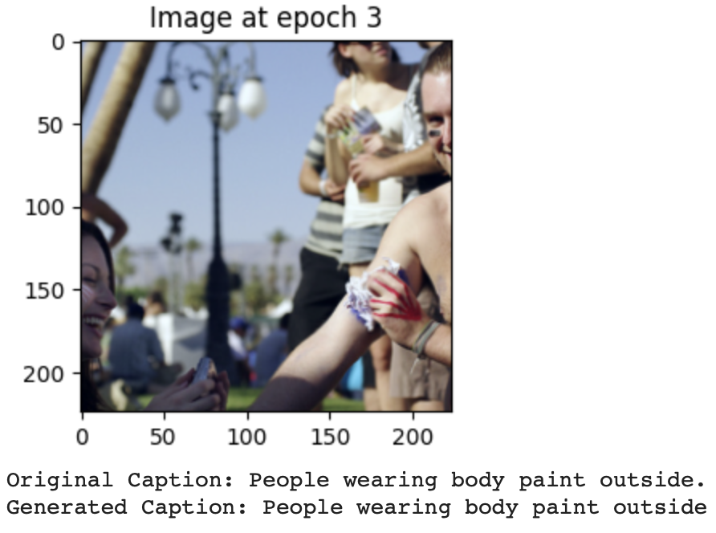
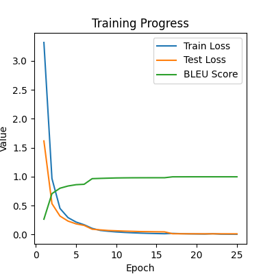
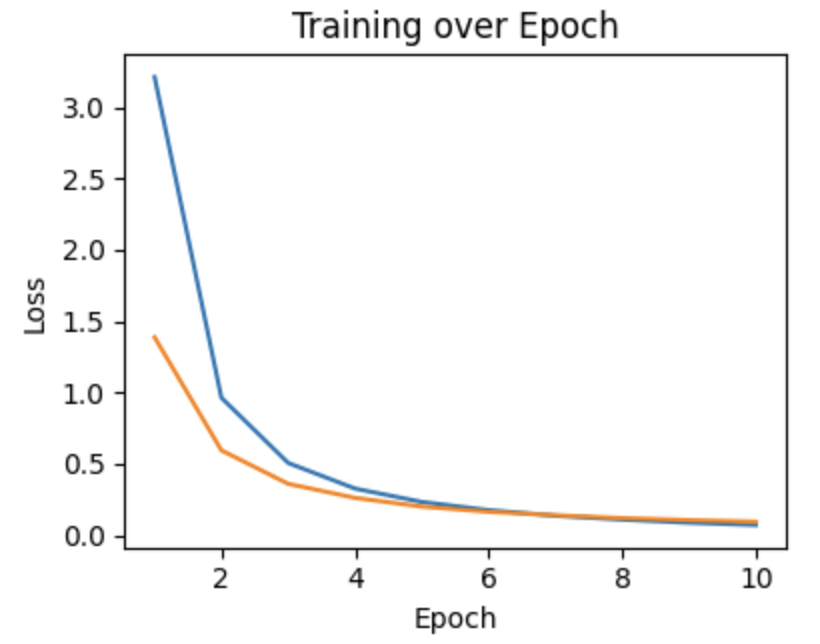
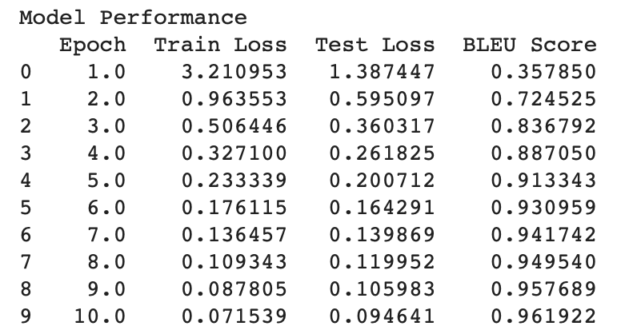

## Image Captioning - Deep Learning
### Dataset
<a href="https://www.kaggle.com/datasets/adityajn105/flickr8k?select=Images">Flickr 8k Dataset</a>

Pretrained models were used for tokenization: bert-base-cased

### Models
* Image encoder: using viT_pretrained_model - google/vit-base-patch16-224
* Caption encoding: using AutoModel.from_pretrained('bert-base-cased', config=bert_config)
* Decoder: TransformerDecoder

### Matric tools
* Cross Entropy Loss
* BLEU 

### The model's performance and issues during training

* During the training process, both train loss and test loss decreased rapidly, and the model was often able to generate correct captions during the test() function by epoch 3. To assess the model's similarity score, Bleu was used. Additionally, the test loss was monitored to observe its decreasing pattern, and after each epoch, the predicted captions were printed using the test() function.
  
  To address the possibility of overfitting, a demo program was created to visualize the generated captions for unseen images using the checkpoints from each epoch. However, the results revealed that no captions were produced.
  
  Despite the model's excellent performance in terms of loss and Bleu score, the inability to generate captions during the demo program indicates a potential issue that needs to be investigated further.
* To eliminate the possibility of the model not training successfully due to overfitting, I attempted to train the model with different dropout values (0.3, 0.4, 0.5). Despite varying the dropout rate, the test() function was still capable of generating perfect captions by epoch 3. However, when using the demo() function on unseen images, no captions were generated.
  
  This suggests that the issue might not be related to overfitting or the dropout rate but could be attributed to other factors affecting the model's performance during the generation of captions for unseen images. Further investigation is required to identify the root cause of the problem.

 

* I made a modification to the decoder model's structure: in the forward function, I rearranged the order of operations. Instead of converting the encoded image and encoded ids' hidden dimensions to the decoder dim before fusion, I first fused the encoded image and encoded ids, and then converted them to the decoder dim. After making this adjustment, the demo() function was able to generate captions for unseen images successfully.
  ```
  combined_features = encoded_images + bert_embeddings      # (batch_size, sequence_length, encoder_dim)
  combined_features = self.fc_combined(combined_features)   # (batch_size, 40, 768)
  combined_features = self.activation(combined_features)
  encoded_images = self.fc_image(encoded_images)
  ```
* Next, I retrained the model and tried various combinations and parameters, I will list three of the most representative ones:

  Tpye 1:
  ```
  batch_size = 100
  lr = 0.00003        
  encoder_dim = 768   
  decoder_dim = 512   
  d_model = 512       
  nhead = 8           
  num_layers = 6      
  num_epoch = 10
  ```
  Type 2:
  ```
  batch_size = 100
  lr = 0.00003        
  encoder_dim = 768   
  decoder_dim = 768   
  d_model = 768       
  nhead = 8           
  num_layers = 6      
  num_epoch = 8
  ```
  Type 3:
  ```
  batch_size = 100
  lr = 0.00003        
  encoder_dim = 768   
  decoder_dim = 512   
  d_model = 512       
  nhead = 16           
  num_layers = 8      
  num_epoch = 10
  dropout = 0.2
  ```
* The three approaches mentioned above all showed stable and consistent improvements in both train and test loss, with nearly perfect predictions generated by the test() function at epoch 3. However, when their respective checkpoints were used in the demo() function to generate captions for unseen images, the results were not very promising, with type1 showing the best performance.
  
  To further improve type 3, I decided to train it for an additional 8 epochs. However, as the loss improvement became slower over time, I made the decision to increase the learning rate from 0.00003 to 0.0003 for the last 3 epochs.
* Increasing the training or raising the learning rate for Type3 did not improve the performance of the demo() function in generating captions for unseen images. The best result was achieved with Type 1. For evaluation purposes, I used a single fixed unseen image.

  Type 1 training performance:

   
  
#### Analyzing the training results for Type1, the performance metrics such as train loss, test loss, and BLEU score were all good, and the generated captions during test() looked promising. However, despite the positive indicators, the performance of demo() in generating captions for unseen images was not satisfactory. The generated captions from demo() contained some keywords representing the image, but the sentences lacked coherence. Apart from further optimizing the model, another possible factor contributing to this issue could be the limited dataset size, as the Flickr8k Dataset only consists of 8,091 images.


  
